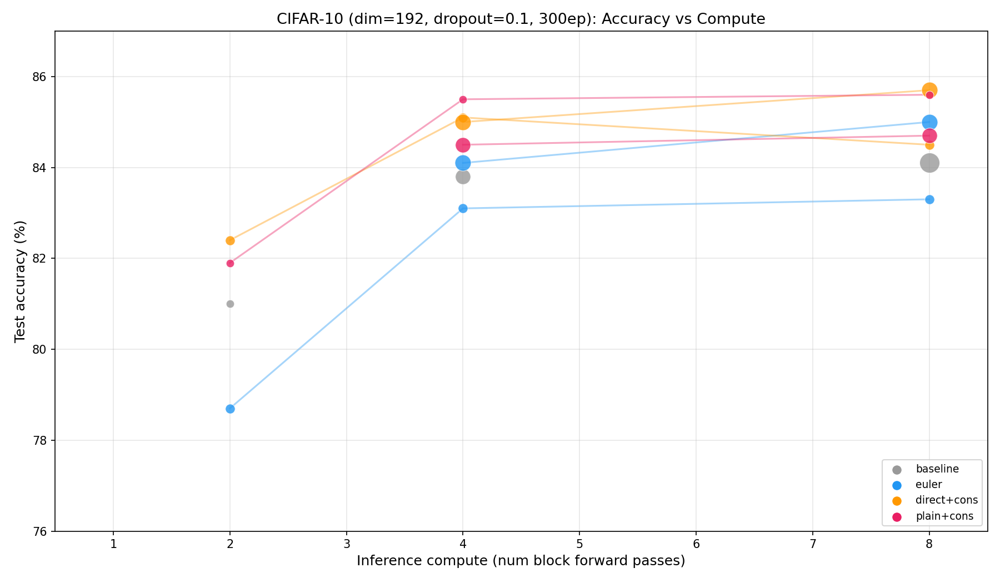

# LoopViT

Adaptive-depth Vision Transformer via weight-shared looping blocks with output distillation.

A small set of transformer blocks (a "unit") is looped K times over the input. At training time, K is sampled uniformly from {1, ..., K_max}, and an output distillation loss encourages low-K paths to match high-K outputs. At inference, K can be chosen freely to trade compute for accuracy.

## Architecture variants

All variants share the same ViT skeleton (patch embed, cls token, positional embed, classifier head). They differ in the transformer block:

| Variant | Time conditioning | Residual scaling | Description |
|---------|------------------|-----------------|-------------|
| `plain` | None | Standard | Plain pre-norm block, looped. Equivalent to [ELT](https://arxiv.org/abs/2604.09168). |
| `euler` | AdaLN on (t_s, t_e) | dt-scaled | Euler-step form: `h + dt * f(h,t)`. Guarantees `block(h,t,t) = h`. |
| `direct` | AdaLN on (t_s, t_e) | Standard | Time-conditioned but no dt scaling. |
| `baseline` | None | Standard | Independent (non-shared) blocks. Standard ViT. |

## Key concepts

- **#bpu** (blocks per unit): number of unique transformer blocks that share weights across loop iterations.
- **K**: number of loop iterations. Total block forward passes = #bpu x K.
- **Output distillation** (`--cons_mode output`): MSE between logits at K_cur and logits at K_max (stop-gradiented). Teaches low-K paths to approximate high-K outputs.

## Results (CIFAR-10, dim=192, dropout=0.1, 300 epochs)

| Model | #bpu | Params | 2 blk | 4 blk | 8 blk |
|---|---|---|---|---|---|
| baseline | 2 | 914K | 81.0 | - | - |
| baseline | 4 | 1.80M | - | 83.8 | - |
| baseline | 8 | 3.58M | - | - | 84.1 |
| euler | 2 | 1.02M | 78.7 | 83.1 | 83.3 |
| euler | 4 | 2.02M | - | 84.1 | 85.0 |
| direct+cons | 2 | 1.02M | 82.4 | 85.1 | 84.5 |
| direct+cons | 4 | 2.02M | - | 85.0 | 85.7 |
| **plain+cons** | **2** | **914K** | **81.9** | **85.5** | **85.6** |

Best result: **plain+cons 2bpu** achieves 85.5% at 4 block passes with 914K params, beating the 8-layer baseline (84.1%, 3.58M params) with 4x fewer parameters and half the compute.


*Circle size indicates parameter count.*

## Training

### Baseline (standard ViT, independent blocks)
```bash
uv run python main.py --dataset cifar10 --model baseline --block_type plain \
    --dim 192 --K 8 --dropout 0.1 --epochs 300 --save models/cifar/baseline/model.pt
```

### LoopViT (plain+cons, recommended)
```bash
uv run python main.py --dataset cifar10 --model continuous --block_type plain \
    --dim 192 --blocks_per_unit 2 --K 4 \
    --cons_w 1.0 --cons_warmup 50 --cons_mode output \
    --dropout 0.1 --epochs 300 --save models/cifar/plain/model.pt
```

### Euler variant
```bash
uv run python main.py --dataset cifar10 --model continuous --block_type euler \
    --dim 192 --blocks_per_unit 4 --K 4 --cons_w 0 \
    --dropout 0.1 --epochs 300 --save models/cifar/euler/model.pt
```

### ImageNet-64
```bash
uv run python main.py --dataset imagenet64 --model baseline --block_type plain \
    --dim 384 --K 8 --dropout 0.1 --epochs 100 --bs 256 \
    --ckpt_every 10 --save models/imagenet64/baseline.pt
```

## Evaluation

Evaluate a checkpoint at multiple K values:
```bash
uv run python main.py --dataset cifar10 --model continuous --block_type plain \
    --dim 192 --blocks_per_unit 2 \
    --load models/cifar/plain/plain_2bpu_K4_cons_d01.pt \
    --eval_only --eval_ks 1,2,4,8
```

## Key flags

| Flag | Description |
|------|-------------|
| `--model` | `continuous` (shared/looped), `baseline` (independent layers), `adaptive` |
| `--block_type` | `plain`, `euler`, `direct` |
| `--blocks_per_unit` | Number of unique blocks in the shared unit |
| `--K` | Max loop iterations during training |
| `--cons_w` | Output distillation weight (0 = disabled) |
| `--cons_warmup` | Linearly ramp cons_w from 0 over N epochs |
| `--cons_mode` | `output` (logit MSE), `linear` (logit linearity), `two_path` (hidden state MSE), `jvp` |
| `--dropout` | Dropout rate (0.1 recommended) |
| `--ckpt_every` | Save checkpoint every N epochs |
| `--dataset` | `cifar10` or `imagenet64` |

## Project structure

```
main.py              # Training and evaluation
plot_pareto.py       # Generate accuracy vs compute plots
logs/
  cifar/             # CIFAR-10 training logs
  imagenet64/        # ImageNet-64 training logs
models/
  cifar/{baseline,euler,direct,plain}/
  imagenet64/
artifacts/           # Plots and figures
```
